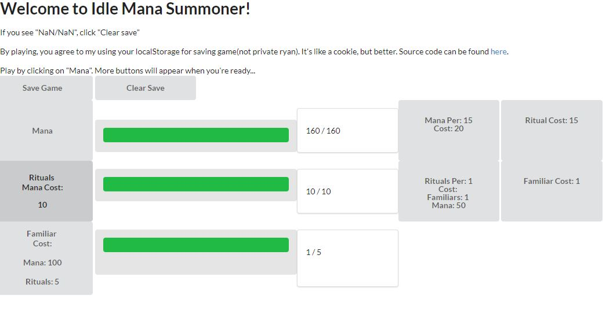
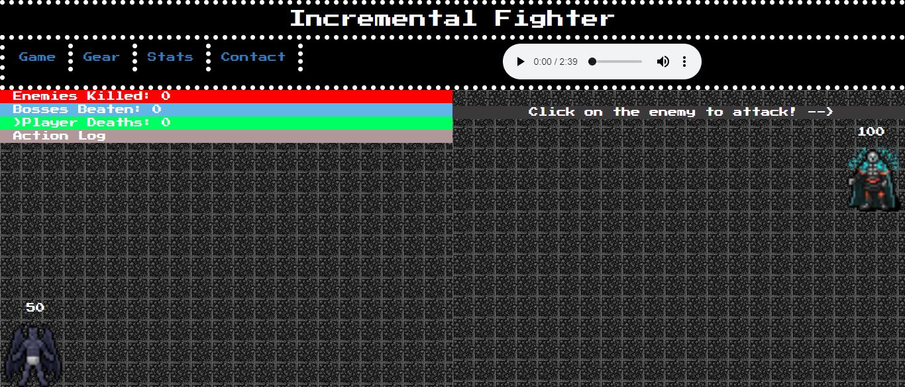
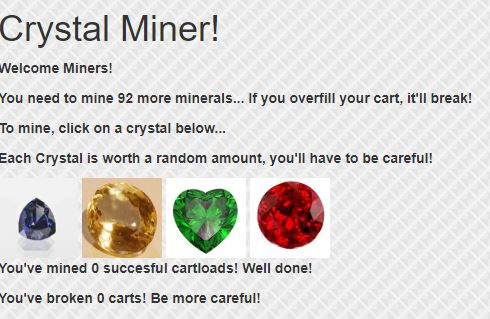
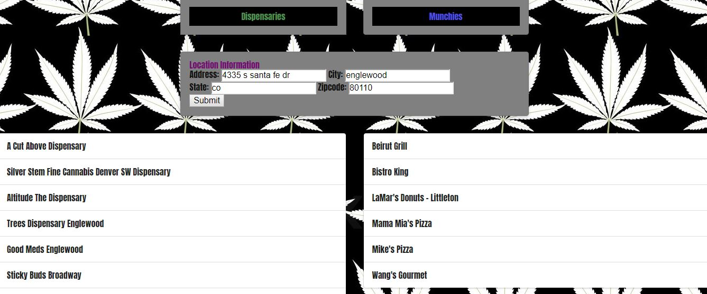
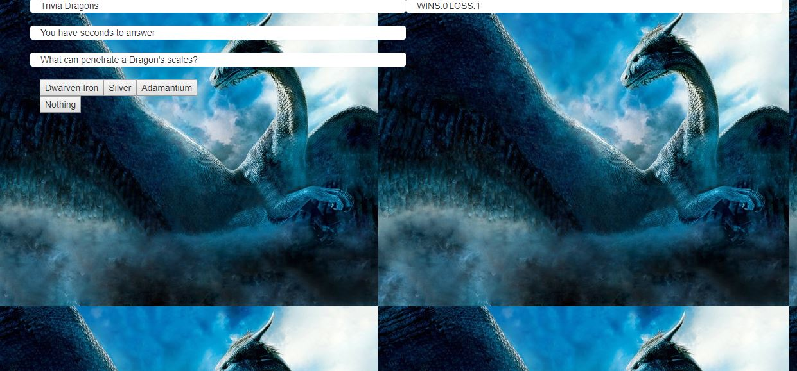

<link rel="stylesheet" type="text/css" media="all" href="./Assets/Css/readme.css" />

# dylanmthomas19.github.io
Thank you for visiting my portfolio! 

<a href="https://www.linkedin.com/in/dylanmthomas19/" target="_blank">LinkedIn Profile</a>

<a href="https://dylanmthomas19.github.io/IdleManaSummoner" target="_blank">Idle Mana Summoner</a>:
 
My first personally made game. Updates will come at a future date after I'm done with classes.

<a href="https://incrementalfighter.herokuapp.com" target="_blank">Incremental Fighter</a>
This game was developed by my group in code bootcamp, I handled frontend JS/Funtionality

<a href="https://dylanmthomas19.github.io/week-4-game/crystalCollector">Crystal Collector</a>
  Simple JS game for early bootcamp

<a href="https://luckybaldrick.github.io/Munchies">Munchies Web App</a>
 First group project for code bootcamp, a cannabis + food combo app

<a href="https://dylanmthomas19.github.io/TriviaGame">Trivia Dragons</a>
 Dragon-themed triva game
